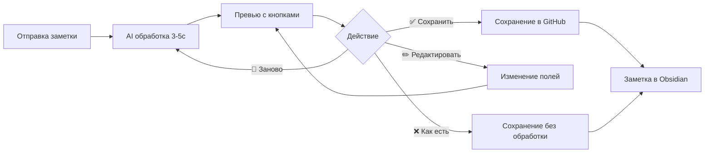

# Smart Processing - Умная обработка заметок

**Версия:** 1.0  
**Дата:** 17.02.2026  
**Статус:** ✅ Активно

---

## 📋 Содержание

- [Что такое Smart Processing](#что-такое-smart-processing)
- [Возможности](#возможности)
- [Как это работает](#как-это-работает)
- [Настройка](#настройка)
- [Использование](#использование)
- [Стоимость](#стоимость)
- [Приватность](#приватность)
- [FAQ](#faq)
- [Примеры](#примеры)

---

## 🎯 Что такое Smart Processing

Smart Processing - это функция автоматической обработки входящих заметок через AI (OpenAI GPT-4o-mini). Бот анализирует содержимое заметки и автоматически извлекает структурированную информацию перед сохранением в Obsidian.

**Простыми словами:** Вместо того чтобы просто сохранить текст "как есть", бот умно обрабатывает его и добавляет полезные метаданные.

---

## ✨ Возможности

### 1. Автоматические теги 🏷️

Бот предлагает 3-5 релевантных тегов на английском языке.

**Пример:**
```
Ваш текст: "Встреча с клиентом завтра в 15:00, обсудить новый проект"
Теги AI: meeting, client, project, business
```

### 2. Краткое резюме 📝

Генерирует информативное резюме (1-2 предложения, макс 200 символов) на языке исходного текста.

**Пример:**
```
Ваш текст: "Сегодня на встрече обсудили план запуска. 
            Решили начать с MVP, старт в марте..."
Резюме AI: "Обсуждение плана запуска с решением начать с MVP в марте"
```

### 3. Извлечение задач ✅

Автоматически находит конкретные действия (action items) в тексте.

**Пример:**
```
Ваш текст: "Завтра нужно позвонить Ивану и отправить отчет. 
            Также купить молоко."
Задачи AI:
- [ ] Позвонить Ивану
- [ ] Отправить отчет
- [ ] Купить молоко
```

### 4. Интерактивное редактирование 💬

После обработки вы можете:
- Отредактировать любое поле (теги, резюме, задачи)
- Перегенерировать результат заново
- Сохранить без обработки

---

## 🔧 Как это работает

### Workflow пользователя



### Шаг за шагом

1. **Отправка заметки**
   - Вы отправляете текст или голосовое сообщение боту
   - Бот показывает: "⏳ Сохраняю заметку..."

2. **AI обработка**
   - Статус меняется на: "🤖 Обрабатываю через AI..."
   - OpenAI GPT-4o-mini анализирует содержимое (~3-5 секунд)

3. **Интерактивное превью**
   - Бот показывает результаты обработки
   - Появляются inline кнопки для действий

4. **Ваш выбор**
   - ✅ **Сохранить** - сохранить с AI обработкой
   - ✏️ **Теги** - отредактировать теги
   - ✏️ **Резюме** - отредактировать резюме
   - ✏️ **Задачи** - отредактировать задачи
   - 🔄 **Заново** - перегенерировать через AI
   - ❌ **Как есть** - сохранить без обработки

5. **Сохранение**
   - Заметка сохраняется в GitHub с метаданными
   - Obsidian автоматически синхронизирует изменения

---

## ⚙️ Настройка

### Включение Smart Processing

1. **Откройте файл `.env`**

2. **Добавьте настройки:**

```env
# Smart Processing
SMART_PROCESSING_ENABLED=true
SMART_PROCESSING_MODEL=gpt-4o-mini
SMART_PROCESSING_TEMPERATURE=0.3
SMART_PROCESSING_MAX_TOKENS=500
MAX_LLM_REQUESTS_PER_HOUR=20
```

3. **Убедитесь, что `OPENAI_API_KEY` настроен:**

```env
OPENAI_API_KEY=sk-proj-xxxxxxxxxxxxxxxxxxxxxxxxxxxxxxxx
```

Где взять API key: https://platform.openai.com/api-keys

### Параметры конфигурации

| Параметр | Значение по умолчанию | Описание |
|----------|----------------------|----------|
| `SMART_PROCESSING_ENABLED` | `true` | Включить/выключить обработку |
| `SMART_PROCESSING_MODEL` | `gpt-4o-mini` | Модель OpenAI для обработки |
| `SMART_PROCESSING_TEMPERATURE` | `0.3` | Креативность (0.0-1.0, меньше = предсказуемее) |
| `SMART_PROCESSING_MAX_TOKENS` | `500` | Максимум токенов в ответе |
| `MAX_LLM_REQUESTS_PER_HOUR` | `20` | Лимит запросов в час |

### Отключение Smart Processing

Установите в `.env`:
```env
SMART_PROCESSING_ENABLED=false
```

Бот будет работать в обычном режиме без AI обработки.

---

## 📱 Использование

### Пример 1: Текстовая заметка

1. Отправьте боту:
```
Завтра важная встреча с инвестором в 14:00. 
Нужно подготовить презентацию и финансовую модель.
```

2. Бот обработает через AI (~3 секунды)

3. Вы увидите превью:
```
🤖 Smart Processing завершена!

📝 Summary: Подготовка к встрече с инвестором
🏷️ Tags: meeting, investor, presentation, finance
✅ Задачи: 3

--- Превью заметки ---
Summary: Подготовка к встрече с инвестором: презентация и финмодель

### Содержание
Завтра важная встреча с инвестором в 14:00...

### Задачи
- [ ] Подготовить презентацию
- [ ] Подготовить финансовую модель
---

[✅ Сохранить]  [✏️ Теги]  [✏️ Резюме]
[✏️ Задачи]  [🔄 Заново]  [❌ Как есть]
```

4. Нажмите **✅ Сохранить**

5. Заметка появится в Obsidian:

```markdown
---
date: 2026-02-17
tags: [inbox, telegram, meeting, investor, presentation, finance]
processed: true
processing_model: gpt-4o-mini
---

# Заметки за 17.02.2026

## 15:45

**Summary:** Подготовка к встрече с инвестором: презентация и финмодель

### Содержание

Завтра важная встреча с инвестором в 14:00. 
Нужно подготовить презентацию и финансовую модель.

### Задачи

- [ ] Подготовить презентацию
- [ ] Подготовить финансовую модель

---
*Источник: Telegram | Обработано: Smart Processing (gpt-4o-mini)*
```

### Пример 2: Редактирование результатов

Если теги не подходят:

1. Нажмите **✏️ Теги**

2. Бот попросит:
```
✏️ Редактирование тегов

Текущие теги: meeting, investor, presentation, finance

Отправьте новые теги через запятую (английский, lowercase):
Пример: project, idea, urgent
```

3. Отправьте:
```
meeting, investor, urgent, mvp
```

4. Бот обновит превью с новыми тегами

5. Нажмите **✅ Сохранить**

### Пример 3: Голосовая заметка

1. Отправьте голосовое сообщение 🎤

2. Бот транскрибирует через Whisper

3. Бот обработает текст через AI

4. Появится превью с метаданными голосового:
```
🤖 Smart Processing завершена! 🎤 (Длительность: 45с, Язык: ru)

📝 Summary: Список покупок на неделю
🏷️ Tags: shopping, groceries, weekly
✅ Задачи: 5
...
```

---

## 💰 Стоимость

### Расценки OpenAI (GPT-4o-mini, февраль 2026)

- **Input:** $0.150 / 1M токенов
- **Output:** $0.600 / 1M токенов

### Стоимость одной обработки

Средняя заметка: ~$0.0002 (0.02¢)

### Месячные сценарии

| Использование | Заметок/день | Заметок/месяц | Стоимость/месяц |
|---------------|--------------|---------------|-----------------|
| Легкое | 10 | 300 | $0.06 |
| Среднее | 30 | 900 | $0.18 |
| Активное | 100 | 3000 | **$0.60** |
| Интенсивное | 200 | 6000 | $1.20 |

**Вывод:** Даже при активном использовании стоимость минимальна (~60 центов в месяц).

---

## 🔐 Приватность

### ⚠️ Важно понимать

При включенном Smart Processing ваши заметки отправляются в OpenAI API для обработки.

### Что это значит

- ✅ Текст заметок передается на серверы OpenAI
- ✅ OpenAI **НЕ использует** данные для обучения моделей (согласно API Terms)
- ✅ Передача данных **зашифрована** (HTTPS)
- ✅ После обработки данные **НЕ хранятся** у OpenAI

### Рекомендации

**НЕ отправляйте через бота:**
- Пароли и токены
- Номера кредитных карт
- Персональные медицинские данные
- Юридически защищенную информацию

**Если вас беспокоит приватность:**
- Отключите Smart Processing: `SMART_PROCESSING_ENABLED=false`
- Используйте кнопку "❌ Как есть" для конфиденциальных заметок
- Рассмотрите self-hosted LLM (будущая функция)

### Политика OpenAI

Из [OpenAI API Data Usage Policy](https://openai.com/policies/api-data-usage-policies):

> "OpenAI will not use data submitted via our API to train or improve our models unless you explicitly opt in."

По умолчанию все данные через API **не используются** для обучения.

---

## 🐛 Решение проблем

### Smart Processing не работает

**Проблема:** Бот не обрабатывает заметки через AI

**Решение:**
1. Проверьте `.env` файл:
   ```env
   SMART_PROCESSING_ENABLED=true
   OPENAI_API_KEY=sk-proj-xxx...
   ```
2. Перезапустите бота
3. Проверьте логи: `python bot.py`

### Превышен лимит запросов

**Проблема:** "⏸ Превышен лимит AI обработки"

**Причина:** Вы отправили более 20 заметок за час

**Решение:**
- Подождите 1 час
- Или увеличьте лимит в `.env`:
  ```env
  MAX_LLM_REQUESTS_PER_HOUR=50
  ```

### Ошибка при обработке

**Проблема:** "⚠️ Не удалось обработать через AI"

**Причина:** Ошибка OpenAI API (timeout, rate limit, и т.д.)

**Решение:**
- Заметка автоматически сохраняется **без обработки**
- Проверьте баланс OpenAI: https://platform.openai.com/usage
- Проверьте статус API: https://status.openai.com

### Некорректные результаты

**Проблема:** AI предлагает нерелевантные теги или задачи

**Решение:**
1. Нажмите **✏️** кнопки и отредактируйте вручную
2. Или нажмите **🔄 Заново** для перегенерации
3. Или используйте **❌ Как есть** для сохранения без обработки

---

## ❓ FAQ

### Q: Можно ли использовать другую модель?

**A:** Да, измените в `.env`:
```env
SMART_PROCESSING_MODEL=gpt-4o
```

Доступные модели:
- `gpt-4o-mini` (рекомендуется) - быстро, дешево
- `gpt-4o` - дороже, но качественнее
- `gpt-3.5-turbo` - дешевле, но хуже качество

### Q: Обрабатываются ли голосовые заметки?

**A:** Да! После транскрибации через Whisper текст обрабатывается через Smart Processing автоматически.

### Q: Можно ли отключить для конкретной заметки?

**A:** Да, просто нажмите кнопку **❌ Как есть** в превью.

### Q: Сколько времени занимает обработка?

**A:** 3-5 секунд в среднем (зависит от нагрузки OpenAI API).

### Q: Можно ли использовать на русском языке?

**A:** Да! Резюме и задачи генерируются на языке исходного текста. Только теги на английском (стандарт для Obsidian).

### Q: Что если OpenAI API недоступен?

**A:** Бот автоматически сохранит заметку без обработки (fallback режим). Вы получите уведомление об ошибке.

### Q: Можно ли настроить промпт?

**A:** Сейчас нет (промпт жестко закодирован). Планируется в будущих версиях.

---

## 📊 Примеры

### Пример 1: Бизнес заметка

**Входной текст:**
```
Встреча с командой прошла продуктивно. Решили рефакторить модуль 
аутентификации и задеплоить на staging к пятнице. Мне нужно 
подготовить ТЗ и настроить CI/CD.
```

**Результат AI:**
```markdown
**Summary:** Продуктивная встреча с решением рефакторить аутентификацию 
              и деплой на staging к пятнице

Tags: meeting, refactoring, deployment, auth, devops

Задачи:
- [ ] Подготовить ТЗ
- [ ] Настроить CI/CD
- [ ] Задеплоить на staging к пятнице
```

### Пример 2: Личная заметка

**Входной текст:**
```
Сегодня отличная погода, пошел гулять в парк. Нужно не забыть 
позвонить маме вечером.
```

**Результат AI:**
```markdown
**Summary:** Прогулка в парке и напоминание позвонить маме

Tags: personal, reminder, family

Задачи:
- [ ] Позвонить маме вечером
```

### Пример 3: Идея проекта

**Входной текст:**
```
Idea: create a tool that analyzes code complexity and suggests 
refactoring options. Use AST parsing, integrate with VS Code.
```

**Результат AI:**
```markdown
**Summary:** Idea for a tool that analyzes code complexity and suggests 
              refactoring using AST parsing

Tags: project-idea, tool, vscode, refactoring, ast

Задачи: []
```

---

## 🔮 Будущие возможности

Планируется в следующих версиях:

- **Категоризация заметок** - автоматическое определение типа (проект/идея/задача/личное)
- **Связывание заметок** - поиск связанных заметок в Obsidian Vault (backlinks)
- **Контекст из Vault** - использование существующих заметок для более точной обработки
- **Персонализация** - обучение на ваших предпочтениях
- **Self-hosted LLM** - поддержка локальных моделей (Llama, Mistral)

---

## 📚 Дополнительные ресурсы

- **[SMART_PROCESSING_TZ.md](SMART_PROCESSING_TZ.md)** - техническое задание (для разработчиков)
- **[SMART_PROCESSING_IMPLEMENTATION.md](SMART_PROCESSING_IMPLEMENTATION.md)** - план реализации (для AI-агентов)
- **[README.md](README.md)** - основная документация бота
- **[GitHub Issue #5](https://github.com/mkoval-pwork/obsidian-telegram-bot/issues/5)** - обсуждение функции

---

## 📝 Обратная связь

Нашли баг или есть предложения? Создайте issue на GitHub:  
https://github.com/mkoval-pwork/obsidian-telegram-bot/issues

---

**Версия:** 1.0  
**Последнее обновление:** 17.02.2026  
**Автор:** mkoval-pwork
